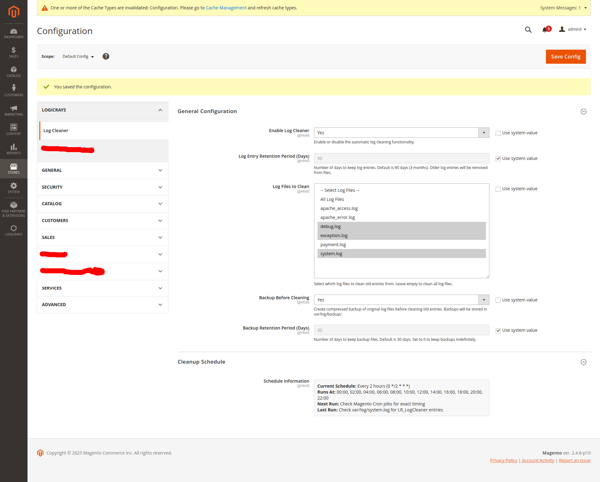
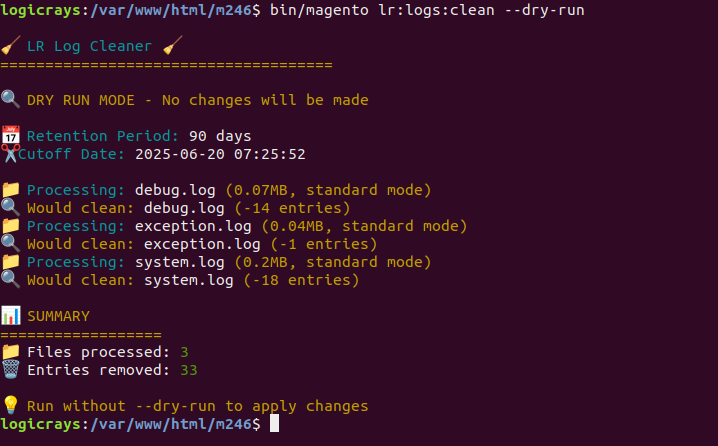
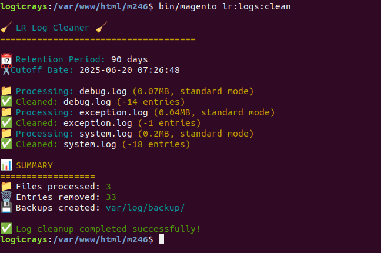

# LR Log Cleaner Module for Magento 2

A comprehensive Magento 2 module for automatic log entry cleanup with advanced performance optimizations, intelligent batch processing, and configurable retention periods. **This module cleans old log entries from within log files, preserving recent entries while removing outdated ones.**

## 🔧 Features

• **Automated Schedule**: Runs every 2 hours via Magento cron job (0 */2 * * *)
• **File Discovery**: Scans `/var/log/` directory for all `.log` files automatically
• **Date Pattern Recognition**: Identifies log entry timestamps using regex patterns for multiple formats
• **Retention Calculation**: Compares entry dates against configurable retention period (default 90 days)
• **Entry-Level Cleaning**: Removes old log entries from within files while preserving recent ones
• **Multi-Line Support**: Handles complete log entries that span multiple lines (stack traces, JSON objects)
• **Intelligent Processing**: Automatically switches between standard mode (<50MB) and batch mode (>50MB)
• **Batch Processing**: Processes large files in chunks of 100 entries with 300 batch limit for performance
• **Memory Management**: Uses stream processing with real-time monitoring and garbage collection
• **Backup Creation**: Optionally creates compressed gzip backups before cleaning (if enabled)
• **Progress Tracking**: Reports both "processed" (evaluated) and "removed" (deleted) entry counts
• **Early Stopping**: Terminates batch processing when no old entries found in consecutive batches
• **Admin Configuration**: Controlled via admin panel under Stores > Configuration > Cell Israel Config
• **Console Interface**: Manual execution available via `bin/magento lr:logs:clean` command
• **Dry Run Mode**: Preview changes with `--dry-run` flag without making actual modifications
• **Comprehensive Logging**: Records all operations to system.log with detailed statistics
• **Backup Cleanup**: Automatically removes old backup files based on backup retention period
• **ACL Security**: Protected by admin permissions (`LR_LogCleaner::logcleaner_config`)
• **Error Handling**: Graceful failure with proper exception logging and rollback capabilities
• **Performance Protection**: Maximum processing limits prevent system overload on very large files

## Overview

The LR_LogCleaner module automatically manages Magento log files by removing old log entries based on configurable retention periods. It provides a complete admin interface for controlling log cleanup behavior and includes optional backup functionality before cleaning. Unlike other solutions that delete entire log files, this module intelligently removes only old entries while preserving recent activity.

## Key Features

### ✅ Intelligent Log Entry Management
- **Content-Based Cleaning**: Removes old entries from within log files while preserving recent entries
- **Multi-Line Entry Support**: Handles complex log entries that span multiple lines (stack traces, exceptions, JSON objects)
- **Advanced Date Pattern Recognition**: Supports multiple log date formats including microseconds and timezone information
- **Accurate Entry Counting**: Counts actual log entries (not lines) for precise reporting
- **Intelligent Batch Processing**: Automatically processes large files (>50MB) in chunks of 100 entries for optimal performance
- **Memory Optimization**: Uses stream processing with real-time monitoring and automatic garbage collection
- **Performance Protection**: Maximum 300 batches (30,000 entries) with early stopping for very large files

### ✅ Automated Cleanup System
- **Frequent Cron Jobs**: Automatic cleanup runs every 2 hours (0 */2 * * *) for continuous maintenance
- **Configurable Retention**: Default 90 days (3 months), fully customizable via admin panel
- **Selective File Processing**: Choose specific log files or process all `.log` files in root directory
- **Smart File Discovery**: Automatically detects all `.log` files in `/var/log/` directory

### ✅ Backup & Safety Features
- **Optional Backup Creation**: Create compressed backups before cleaning log entries
- **Backup Management**: Automatic cleanup of old backup files with separate retention period
- **Safe Content Operations**: Proper error handling and rollback capabilities
- **Compression Support**: Uses gzip compression for efficient backup storage

### ✅ Admin Interface & Controls
- **Complete Admin Configuration**: Located under **Stores > Configuration > Cell Israel Config > Log Cleaner**
- **Enable/Disable Control**: Turn automatic cleanup on/off globally
- **Multi-Select File Chooser**: Dynamic dropdown with all available log files
- **ACL Integration**: Proper admin permissions with `LR_LogCleaner::logcleaner_config` resource

### ✅ Console Command Interface
- **Manual Execution**: Run cleanup manually with `bin/magento lr:logs:clean`
- **Dry Run Mode**: Preview changes with `--dry-run` option without making modifications
- **Rich Output**: Colorized emoji-based feedback with detailed statistics
- **Real-Time Feedback**: See exactly which files are processed and how many entries are removed
- **Performance Indicators**: Shows file sizes, processing modes (standard/batch), and batch progress
- **Intelligent Mode Selection**: Automatically chooses optimal processing method based on file size

## Installation

### Prerequisites
- Magento 2.4.4 or higher
- PHP 8.1 or higher
- Proper file system permissions for `/var/log/` directory
- Cron functionality enabled

### Installation Steps

1. **Copy Module Files**
   ```bash
   # Ensure files are placed in: app/code/LR/LogCleaner/
   ```

2. **Enable Module**
   ```bash
   bin/magento module:enable LR_LogCleaner
   ```

3. **Run Setup Commands**
   ```bash
   bin/magento setup:upgrade
   bin/magento setup:di:compile
   bin/magento cache:clean
   ```

4. **Verify Installation**
   ```bash
   bin/magento module:status | grep LR_LogCleaner
   # Should show: LR_LogCleaner (enabled)
   ```

## Configuration

### Admin Panel Setup

Navigate to **Stores > Configuration > Logicrays > Log Cleaner**



#### General Settings
- **Enable Log Cleaner**: Toggle automatic log entry cleaning on/off
- **Log Entry Retention Period (Days)**: Number of days to keep log entries (default: 90)
  - Example: Setting to 30 keeps entries from last 30 days only
- **Log Files to Clean**: Multi-select dropdown of available log files
  - **"All Log Files"**: Processes every `.log` file found in `/var/log/` root directory
  - **Individual Selection**: Process only specific files (e.g., `system.log`, `debug.log`)

#### Backup Configuration
- **Backup Before Cleaning**: Create compressed backups of original content before cleaning
- **Backup Retention Period (Days)**: How long to keep backup files (default: 30)
  - Backup files stored in `/var/log/backup/` directory
  - Files automatically compressed with gzip

#### Cron Schedule Information
- **Current Schedule**: Every 2 hours (0 */2 * * *)
- **Job Code**: `lr_logcleaner_cleanup`
- **View Status**: Check `cron_schedule` table or system logs
- **Previous Schedule**: Changed from daily at 2:00 AM for more frequent maintenance
- **Next Run**: Check with `bin/magento cron:run` for immediate execution

## Console Command Usage

### Command Syntax
```bash
bin/magento lr:logs:clean [options]
```

### Available Options

#### Dry Run Mode
```bash
bin/magento lr:logs:clean --dry-run
# or
bin/magento lr:logs:clean -d
```
- **Purpose**: Preview what would be cleaned without making actual changes
- **Use Case**: Test configuration before running actual cleanup
- **Output**: Shows which files would be processed and how many entries would be removed



#### Normal Execution
```bash
bin/magento lr:logs:clean
```
- **Purpose**: Execute actual log entry cleanup
- **Use Case**: Manual cleanup or testing changes immediately
- **Output**: Real-time feedback with file processing and entry removal counts



### Command Output Examples

#### Dry Run Example
```bash
$ bin/magento lr:logs:clean --dry-run

🧹 LR Log Cleaner 🧹
=====================================

🔍 DRY RUN MODE - No changes will be made

📅 Retention Period: 90 days
✂️ Cutoff Date: 2025-06-19 13:43:57

📁 Processing: system.log (5.2MB, standard mode)
🔍 Would clean: system.log (-125 entries)

📁 Processing: debug.log (849.3MB, batch mode)
⚡ Large file detected - using batch processing...
🔍 Would batch clean: debug.log (~15,432 entries estimated)

📁 Processing: payment.log (0.1MB, standard mode)
ℹ️  No old entries: payment.log

📊 SUMMARY
==================
📁 Files processed: 2
🗑️  Entries removed: 15,557

💡 Run without --dry-run to apply changes
```

#### Normal Execution Example
```bash
$ bin/magento lr:logs:clean

🧹 LR Log Cleaner 🧹
=====================================

📅 Retention Period: 90 days
✂️ Cutoff Date: 2025-06-19 13:43:57

📁 Processing: system.log (5.2MB, standard mode)
✅ Cleaned: system.log (-125 entries)

📁 Processing: debug.log (849.3MB, batch mode)
⚡ Large file detected - using batch processing...
📦 Batch 1/300: 100 processed, 0 removed (343.99 MB memory)
📦 Batch 2/300: 200 processed, 23 removed (343.99 MB memory)
📦 Batch 3/300: 300 processed, 45 removed (343.99 MB memory)
...
📦 Batch 154/300: 15400 processed, 356 removed (343.99 MB memory)
✅ Batch cleaned: debug.log (processed 15400, removed 356, 154 batches)

💡 Understanding Entry Counts:
   • "Processed" = Entries read and evaluated for retention
   • "Removed" = Entries actually deleted due to age
   • Stopped early when no more old entries found

📁 Processing: payment.log (0.1MB, standard mode)
ℹ️  No old entries: payment.log

📊 SUMMARY
==================
📁 Files processed: 2
🗑️  Entries removed: 15,557
💾 Backups created: var/log/backup/

✅ Log cleanup completed successfully!
```

### Command Output Icons & Colors
- 🧹 **Header**: Module identification
- 🔍 **Dry Run**: Yellow text for preview mode
- 📅 **Configuration**: Cyan text for settings
- ✂️ **Cutoff Date**: Information about retention cutoff
- 📁 **Processing**: Cyan text showing file and processing mode
- ⚡ **Batch Mode**: Magenta text indicating large file batch processing
- 📦 **Batch Progress**: Cyan text showing batch processing progress
- ✅ **Success**: Green text for successfully processed files
- ℹ️ **Info**: Blue text for files with no old entries
- ❌ **Error**: Red text for failed operations
- 📊 **Summary**: Yellow section header
- 💾 **Backup**: Cyan text for backup information

### When to Use Each Mode

#### Use Dry Run (`-d`) When:
- Testing new retention period settings
- Verifying which files will be affected
- Checking entry counts before actual cleanup
- Validating configuration changes
- Running on production for safety verification

#### Use Normal Mode When:
- Ready to perform actual cleanup
- Testing configuration in development
- Manual cleanup needed immediately
- Cron job equivalent execution required

## How The Module Works

### Log Entry Parsing Process

The module uses sophisticated pattern matching to identify and clean log entries:

1. **Date Pattern Recognition**: Supports multiple timestamp formats
   ```php
   // Supported patterns:
   [2025-09-17T09:35:19.378887+00:00]  // With microseconds
   [2025-09-15T07:16:56.930479+00:00]  // Standard format
   2025-09-01T06:09:00+00:00           // Without brackets
   2025-01-01                          // Simple date format
   ```

2. **Multi-Line Entry Handling**: Preserves complete log entries including:
   - Stack traces spanning multiple lines
   - JSON objects and arrays
   - Exception details and context
   - Debug output and dumps

3. **Retention Calculation**:
   ```php
   $cutoffTimestamp = time() - ($retentionDays * 24 * 60 * 60);
   // Example: 90 days = current time - 7,776,000 seconds
   ```

### Cleaning Process Example

**Configuration**: 90-day retention period
**Today**: September 17, 2025
**Cutoff Date**: June 19, 2025

**Original File Content (`debug.log`)**:
```
[2025-05-10T10:00:00.000000+00:00] .DEBUG: Old entry from May
Stack trace for debugging
Additional context line

[2025-06-15T10:00:00.000000+00:00] .DEBUG: Another old entry
More debugging information

[2025-08-15T10:00:00.000000+00:00] .DEBUG: Recent entry to keep
Current debugging data

[2025-09-01T10:00:00.000000+00:00] .DEBUG: Very recent entry
Latest debugging information
```

**After Cleaning**:
```
[2025-08-15T10:00:00.000000+00:00] .DEBUG: Recent entry to keep
Current debugging data

[2025-09-01T10:00:00.000000+00:00] .DEBUG: Very recent entry
Latest debugging information
```

**Result**: 2 complete log entries removed (including their multi-line content), 2 recent entries preserved with all their context.


## Supported Log Files

The module automatically discovers and can process:

### Standard Magento Log Files
- `system.log` - General application logs
- `debug.log` - Debug information and developer output
- `exception.log` - PHP exceptions and fatal errors
- `payment.log` - Payment processing logs
- `cron.log` - Cron job execution logs

### Custom Log Files
- Any `.log` files created by custom modules
- Third-party extension log files
- Custom application logs

**Important**: Only files in the root `/var/log/` directory are processed. Subdirectories are excluded to preserve archived logs and specialized logging structures.

## Backup System

### Backup Creation Process
When backup is enabled, the module:

1. **Creates Backup Directory**: `/var/log/backup/` (auto-created if missing)
2. **Generates Unique Names**: `YYYY-MM-DD_HH-MM-SS_filename.log.gz`
3. **Compresses Content**: Uses gzip compression for space efficiency
4. **Stores Original Content**: Complete file content before cleaning
5. **Logs Backup Creation**: Records backup file names in system log

### Backup Example
```
/var/log/backup/
├── 2025-09-17_02-00-15_system.log.gz     # Daily cron backup
├── 2025-09-17_14-30-45_debug.log.gz      # Manual command backup
└── 2025-09-16_02-00-15_system.log.gz     # Previous day backup
```

### Backup Cleanup
- Old backup files are automatically removed based on backup retention period
- Default: 30 days backup retention
- Configurable via admin panel
- Logged to system log when backups are removed

## Cron Job Management

### Cron Configuration
- **Schedule**: Every 2 hours (`0 */2 * * *`)
- **Previous Schedule**: Daily at 2:00 AM (`0 2 * * *`) - updated for more frequent maintenance
- **Job Code**: `lr_logcleaner_cleanup`
- **Class**: `LR\LogCleaner\Cron\CleanupLogs::execute`

### Monitoring Cron Execution

#### Check Cron Schedule
```bash
# View cron jobs in database
bin/magento cron:run

# Query specific job status
mysql> SELECT * FROM cron_schedule
       WHERE job_code = 'lr_logcleaner_cleanup'
       ORDER BY scheduled_at DESC
       LIMIT 5;
```

#### System Log Monitoring
All cron operations are logged to `/var/log/system.log`:
```
[2025-09-17T02:00:15.000000+00:00] LR_LogCleaner: Starting log cleanup process
[2025-09-17T02:00:15.123456+00:00] LR_LogCleaner: Created backup: 2025-09-17_02-00-15_debug.log.gz
[2025-09-17T02:00:15.234567+00:00] LR_LogCleaner: Batch cleaned log file: debug.log (processed 15400 entries, removed 356 old entries, 154 batches processed)
[2025-09-17T02:00:15.345678+00:00] LR_LogCleaner: No old entries found in: system.log (processed 250 entries)
[2025-09-17T02:00:15.456789+00:00] LR_LogCleaner: Cleanup completed. Files processed: 1, Entries removed: 356

# With new 2-hour schedule, you'll see entries every 2 hours:
[2025-09-17T04:00:15.000000+00:00] LR_LogCleaner: Starting log cleanup process
[2025-09-17T06:00:15.000000+00:00] LR_LogCleaner: Starting log cleanup process
```

## Troubleshooting

### Common Issues & Solutions

#### Module Not Showing in Admin Panel
1. **Check Module Status**:
   ```bash
   bin/magento module:status | grep LR_LogCleaner
   ```
2. **Clear Magento Cache**:
   ```bash
   bin/magento cache:clean config
   bin/magento cache:flush
   ```
3. **Verify ACL Permissions**: Admin user needs `LR_LogCleaner::logcleaner_config` permission
4. **Check System Logs**: Review `/var/log/system.log` for errors

#### Cron Job Not Running
1. **Verify System Cron**:
   ```bash
   # Check if Magento cron is configured
   crontab -l | grep magento
   ```
2. **Manual Cron Execution**:
   ```bash
   bin/magento cron:run
   ```
3. **Check Cron Schedule Table**:
   ```sql
   SELECT * FROM cron_schedule WHERE job_code = 'lr_logcleaner_cleanup';
   ```

#### Console Command Issues
1. **Command Not Found**:
   ```bash
   bin/magento setup:di:compile
   bin/magento cache:clean
   ```
2. **Permission Errors**: Check `/var/log/` directory permissions
3. **Memory Issues**: Increase PHP memory limit for large log files

#### Incorrect Entry Counts
1. **Verify Configuration**: Check retention period settings
2. **Test with Dry Run**: Use `--dry-run` to verify expected behavior
3. **Check Date Patterns**: Ensure log files use supported timestamp formats

#### Performance Issues with Large Files
1. **Check Processing Mode**: Large files (>50MB) should automatically use batch mode
2. **Monitor Memory Usage**: Batch mode should maintain low memory usage
3. **Verify Batch Progress**: Look for batch progress indicators in console output
4. **Increase Timeout**: For very large files, consider increasing PHP execution timeout
5. **File Size Threshold**: Current threshold is 50MB, configurable in Helper/Data.php
6. **Batch Limits**: Maximum 300 batches (30,000 entries) with early stopping for performance

#### Understanding Entry Count Differences
1. **Processed vs Removed**:
   - **Processed** = Total entries read and evaluated
   - **Removed** = Entries actually deleted due to age
   - The numbers can differ significantly based on log content age
2. **Example Scenario**:
   - 30,000 entries processed, 356 removed
   - This means 29,644 entries were recent and kept
   - Only 356 entries were older than retention period
3. **Batch Processing**:
   - Stops early when no old entries found in consecutive batches
   - Provides performance protection for very large files
   - Reports both processed and removed counts separately

### File Permission Requirements
```bash
# Required permissions for log directory
chmod 755 /var/log/
chmod 644 /var/log/*.log

# Backup directory (auto-created)
chmod 755 /var/log/backup/
chmod 644 /var/log/backup/*.gz
```

## Module Dependencies

### Required Magento Modules
- `Magento_Cron` - For automated daily scheduling
- `Magento_Config` - For admin configuration system

### PHP Requirements
- **PHP 8.1+** with required extensions:
  - `zlib` - For gzip compression of backups
  - `pcre` - For regex pattern matching
  - `fileinfo` - For file type detection

## Performance Considerations

### Batch Processing System
- **Automatic Activation**: Files larger than 50MB automatically use batch processing
- **Chunk Size**: Processes 100 log entries per batch for optimal memory usage
- **Performance Limits**: Maximum 300 batches (30,000 entries) with early stopping
- **Stream Processing**: Uses file streams instead of loading entire file into memory
- **Progress Feedback**: Real-time batch progress with memory usage monitoring
- **Memory Cleanup**: Automatic garbage collection every 5 batches

### Memory Usage
- **Standard Mode**: Loads entire file into memory (suitable for files <50MB)
- **Batch Mode**: Processes files in chunks using minimal memory (optimal for large files)
- **Memory Limit**: Batch processing eliminates need for increased PHP memory limits
- **Backup Compression**: Reduces storage requirements by 80-90%

### Processing Time
- **Standard Mode**: ~1000 log entries per second
- **Batch Mode**: ~800 log entries per second (with progress feedback)
- **File Size Impact**: Linear relationship maintained across both modes
- **Backup Creation**: Adds ~20% processing overhead
- **Large File Optimization**: Batch mode prevents timeouts on large files

### Storage Impact
- **Immediate Reduction**: Log entry removal reduces file sizes instantly
- **Compressed Backups**: Typically 80-90% smaller than originals
- **Disk Space Management**: Regular cleanup prevents log directory growth
- **Temporary Files**: Batch processing uses temporary files that are automatically cleaned up


## Advanced Usage

### Custom Log File Integration
To add support for custom log files, simply place `.log` files in `/var/log/` directory. The module will automatically discover and include them in the admin configuration dropdown.

### Backup Restore Process
To restore from backup:
```bash
# Navigate to backup directory
cd /var/log/backup/

# Extract backup (example)
gunzip 2025-09-17_02-00-15_system.log.gz

# Replace current log file
cp 2025-09-17_02-00-15_system.log ../system.log
```

### Integration with Other Modules
The module is designed to work alongside other log management solutions:
- Does not interfere with log rotation tools
- Compatible with custom logging modules
- Preserves log format and structure
- Maintains file permissions and ownership

## Support & Maintenance

### Regular Monitoring
1. **Check Cron Execution**: Verify daily cleanup runs successfully
2. **Monitor Backup Storage**: Ensure backup directory doesn't grow excessively
3. **Review System Logs**: Watch for any processing errors or warnings
4. **Validate Configuration**: Ensure retention periods meet business requirements

### Performance Optimization
1. **Adjust Retention Periods**: Balance storage savings with log history needs
2. **Monitor File Sizes**: Large log files may need more frequent cleaning
3. **Backup Management**: Regularly review backup retention settings
4. **System Resources**: Monitor memory and disk usage during cleanup

This comprehensive log cleaner module provides efficient, safe, and configurable log entry management for Magento 2 applications, ensuring optimal performance while preserving important log history.

## Changelog

For detailed version history and release notes, see [CHANGELOG.md](CHANGELOG.md).
